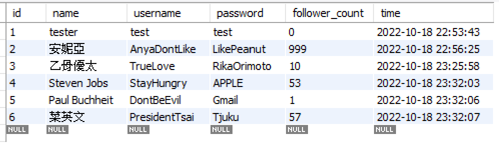
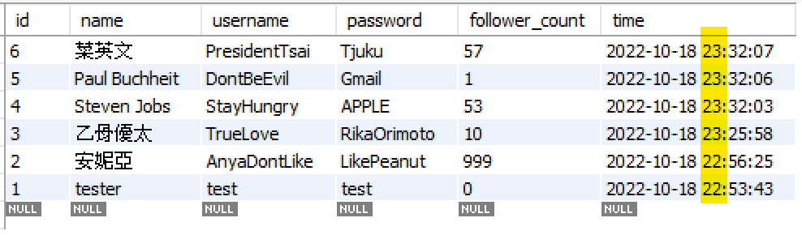
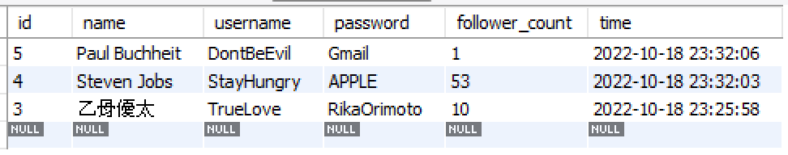
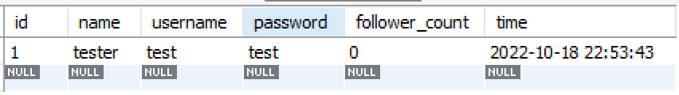
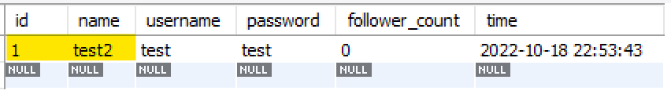
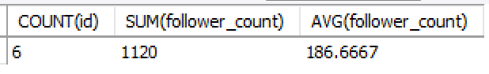
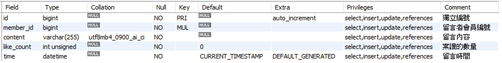
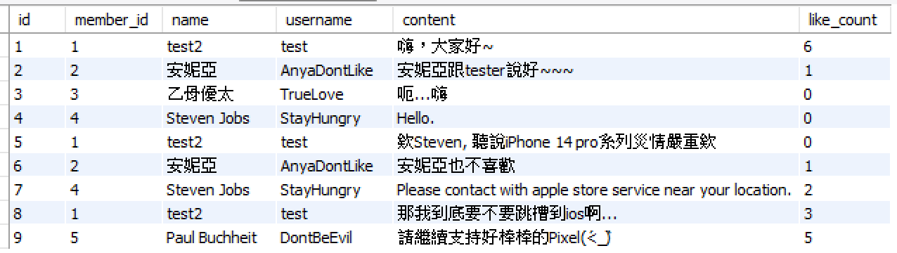
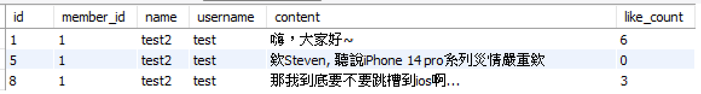

# Assignment Week 5 

## 【要求三】-1 & 2

SQL指令：

```SQL
INSERT INTO member(name, username, password) VALUES('tester', 'test', 'test');
INSERT INTO member(name, username, password, follower_count) VALUES('安妮亞', 'AnyaDontLike', 'LikePeanut', 999);
INSERT INTO member(name, username, password, follower_count) VALUES('乙骨優太', 'TrueLove', 'RikaOrimoto', 10);
INSERT INTO member(name, username, password, follower_count) VALUES('Steven Jobs', 'StayHungry', 'APPLE', 53);
INSERT INTO member(name, username, password, follower_count) VALUES('Paul Buchheit', 'DontBeEvil', 'Gmail', 1);
INSERT INTO member(name, username, password, follower_count) VALUES('菜英文', 'PresidentTsai', 'Tjuku', 57);
SELECT * FROM member;
```

執行結果：

```
+----+---------------+---------------+-------------+----------------+---------------------+
| id | name          | username      | password    | follower_count | time                |
+----+---------------+---------------+-------------+----------------+---------------------+
|  1 | tester        | test          | test        |              0 | 2022-10-18 22:53:43 |
|  2 | 安妮亞        | AnyaDontLike  | LikePeanut  |            999 | 2022-10-18 22:56:25 |
|  3 | 乙骨優太      | TrueLove      | RikaOrimoto |             10 | 2022-10-18 23:25:58 |
|  4 | Steven Jobs   | StayHungry    | APPLE       |             53 | 2022-10-18 23:32:03 |
|  5 | Paul Buchheit | DontBeEvil    | Gmail       |              1 | 2022-10-18 23:32:06 |
|  6 | 菜英文        | PresidentTsai | Tjuku       |             57 | 2022-10-18 23:32:07 |
+----+---------------+---------------+-------------+----------------+---------------------+
```



---

## 【要求三】- 3

SQL指令：

```SQL
SELECT * FROM member ORDER BY time DESC;
```

執行結果：

```
+----+---------------+---------------+-------------+----------------+---------------------+
| id | name          | username      | password    | follower_count | time                |
+----+---------------+---------------+-------------+----------------+---------------------+
|  6 | 菜英文        | PresidentTsai | Tjuku       |             57 | 2022-10-18 23:32:07 |
|  5 | Paul Buchheit | DontBeEvil    | Gmail       |              1 | 2022-10-18 23:32:06 |
|  4 | Steven Jobs   | StayHungry    | APPLE       |             53 | 2022-10-18 23:32:03 |
|  3 | 乙骨優太      | TrueLove      | RikaOrimoto |             10 | 2022-10-18 23:25:58 |
|  2 | 安妮亞        | AnyaDontLike  | LikePeanut  |            999 | 2022-10-18 22:56:25 |
|  1 | tester        | test          | test        |              0 | 2022-10-18 22:53:43 |
+----+---------------+---------------+-------------+----------------+---------------------+
```



---

## 【要求三】- 4

SQL指令：

```SQL
SELECT * FROM member ORDER BY time DESC LIMIT 1,3;
```

執行結果：

```
+----+---------------+------------+-------------+----------------+---------------------+
| id | name          | username   | password    | follower_count | time                |
+----+---------------+------------+-------------+----------------+---------------------+
|  5 | Paul Buchheit | DontBeEvil | Gmail       |              1 | 2022-10-18 23:32:06 |
|  4 | Steven Jobs   | StayHungry | APPLE       |             53 | 2022-10-18 23:32:03 |
|  3 | 乙骨優太      | TrueLove   | RikaOrimoto |             10 | 2022-10-18 23:25:58 |
+----+---------------+------------+-------------+----------------+---------------------+
```



---

## 【要求三】- 5 & 6

SQL指令：

```SQL
SELECT * FROM member WHERE username='test';
SELECT * FROM member WHERE username='test' AND password='test';
```

執行結果(5&6恰好相同)：

```
+----+-------+----------+----------+----------------+---------------------+
| id | name  | username | password | follower_count | time                |
+----+-------+----------+----------+----------------+---------------------+
|  1 | tester| test     | test     |              0 | 2022-10-18 22:53:43 |
+----+-------+----------+----------+----------------+---------------------+
```



---

## 【要求三】- 7

SQL指令：

```SQL
SET sql_safe_updates=0;
UPDATE member SET name='test2' WHERE username='test';
SELECT * FROM member WHERE username='test';
```

執行結果：

```
+----+-------+----------+----------+----------------+---------------------+
| id | name  | username | password | follower_count | time                |
+----+-------+----------+----------+----------------+---------------------+
|  1 | test2 | test     | test     |              0 | 2022-10-18 22:53:43 |
+----+-------+----------+----------+----------------+---------------------+
```




---

## 【要求四】- 1 & 2 & 3

SQL指令：

```SQL
SELECT COUNT(id), SUM(follower_count), AVG(follower_count)
    FROM member;
```

執行結果：

```
+-----------+---------------------+---------------------+
| COUNT(id) | SUM(follower_count) | AVG(follower_count) |
+-----------+---------------------+---------------------+
|         6 |                1120 |            186.6667 |
+-----------+---------------------+---------------------+
```



---

## 【要求五】- 1

SQL指令：

```SQL
CREATE TABLE message(
	id BIGINT PRIMARY KEY AUTO_INCREMENT COMMENT '獨立編號',
    member_id BIGINT NOT NULL COMMENT '留言者會員編號',
    content VARCHAR(255) NOT NULL COMMENT '留言內容',
    like_count INT UNSIGNED NOT NULL DEFAULT 0 COMMENT '按讚的數量',
    time DATETIME NOT NULL DEFAULT CURRENT_TIMESTAMP COMMENT '留言時間',
    FOREIGN KEY (member_id) REFERENCES member(id)
);
SHOW FULL COLUMNS FROM message;
```

執行結果：

```
+------------+--------------+--------------------+------+-----+-------------------+-------------------+---------------------------------+----------------+
| Field      | Type         | Collation          | Null | Key | Default           | Extra             | Privileges                      | Comment        |
+------------+--------------+--------------------+------+-----+-------------------+-------------------+---------------------------------+----------------+
| id         | bigint       | NULL               | NO   | PRI | NULL              | auto_increment    | select,insert,update,references | 獨立編號       |
| member_id  | bigint       | NULL               | NO   | MUL | NULL              |                   | select,insert,update,references | 留言者會員編號 |
| content    | varchar(255) | utf8mb4_0900_ai_ci | NO   |     | NULL              |                   | select,insert,update,references | 留言內容       |
| like_count | int unsigned | NULL               | NO   |     | 0                 |                   | select,insert,update,references | 案讚的數量     |
| time       | datetime     | NULL               | NO   |     | CURRENT_TIMESTAMP | DEFAULT_GENERATED | select,insert,update,references | 留言時間       |
+------------+--------------+--------------------+------+-----+-------------------+-------------------+---------------------------------+----------------+
```



---

## 【要求五】- 2

SQL指令：

```SQL
SELECT message.id, message.member_id, member.name, member.username, message.content, message.like_count
	FROM message INNER JOIN member ON message.member_id=member.id;
```

執行結果：

```
+----+-----------+---------------+--------------+-------------------------------------------------------------+------------+
| id | member_id | name          | username     | content                                                     | like_count |
+----+-----------+---------------+--------------+-------------------------------------------------------------+------------+
|  1 |         1 | test2         | test         | 嗨，大家好~                                                 |          6 |
|  2 |         2 | 安妮亞        | AnyaDontLike | 安妮亞跟tester說好~~~                                       |          1 |
|  3 |         3 | 乙骨優太      | TrueLove     | 呃...嗨                                                     |          0 |
|  4 |         4 | Steven Jobs   | StayHungry   | Hello.                                                      |          0 |
|  5 |         1 | test2         | test         | 欸Steven, 聽說iPhone 14 pro系列災情嚴重欸                   |          0 |
|  6 |         2 | 安妮亞        | AnyaDontLike | 安妮亞也不喜歡                                              |          1 |
|  7 |         4 | Steven Jobs   | StayHungry   | Please contact with apple store service near your location. |          2 |
|  8 |         1 | test2         | test         | 那我到底要不要跳槽到ios啊...                                |          3 |
|  9 |         5 | Paul Buchheit | DontBeEvil   | 請繼續支持好棒棒的Pixel(ˊ<_ˋ)                             |          5 |
+----+-----------+---------------+--------------+-------------------------------------------------------------+------------+
```



---

## 【要求五】- 3

SQL指令：

```SQL
SELECT message.id, message.member_id, member.name, member.username, message.content, message.like_count 
	FROM message INNER JOIN member ON message.member_id=member.id 
	WHERE member.username='test';
```

執行結果：

```
+----+-----------+-------+----------+-------------------------------------------+------------+
| id | member_id | name  | username | content                                   | like_count |
+----+-----------+-------+----------+-------------------------------------------+------------+
|  1 |         1 | test2 | test     | 嗨，大家好~                               |          6 |
|  5 |         1 | test2 | test     | 欸Steven, 聽說iPhone 14 pro系列災情嚴重欸 |          0 |
|  8 |         1 | test2 | test     | 那我到底要不要跳槽到ios啊...              |          3 |
+----+-----------+-------+----------+-------------------------------------------+------------+
```



---

## 【要求五】- 4

SQL指令：

```SQL
SELECT message.member_id, member.name, member.username, COUNT(like_count), SUM(like_count), AVG(like_count) 
	FROM message INNER JOIN member ON message.member_id=member.id 
	WHERE member.username='test';
```

執行結果：

```
+-----------+-------+----------+-------------------+-----------------+-----------------+
| member_id | name  | username | COUNT(like_count) | SUM(like_count) | AVG(like_count) |
+-----------+-------+----------+-------------------+-----------------+-----------------+
|         1 | test2 | test     |                 3 |               9 |          3.0000 |
+-----------+-------+----------+-------------------+-----------------+-----------------+
```


---